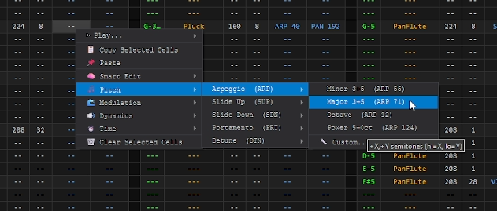
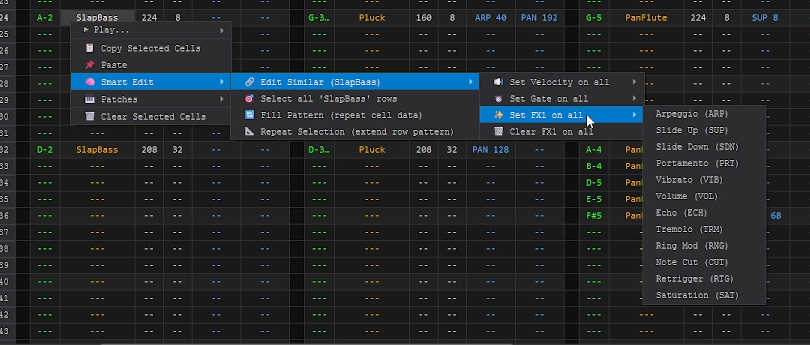

# Lanthorn PSG

**A chiptune-style tracker and SFX painter for composing retro game audio.**

Lanthorn PSG is a desktop application for composing tracker-style music and sound effects, featuring a step sequencer, a live waveform visualizer, a patch workbench for sound design, and multi-format audio export (WAV, OGG, MP3).


---

## Features

- **Step Sequencer** — multi-track tracker with gate, velocity, FX commands (VIB, TRM, ECH, ARP, PRT, SAT, and more)
- **Patch Workbench** — design patches with dual oscillators, ADSR envelope, LFO, echo, ring mod, bit crusher, and portamento
- **Live Visualizer** — real-time waveform and spectrum display
- **Audio Export** — WAV (HQ / MidFi / Retro), OGG, and MP3 via pydub
- **Preset Library** — built-in preset bank organised by category (leads, bass, pads, keys, drums, strings)
- **Demo Projects** — `Bazaar.csv`, `Lanthorn.csv`, and `Iron_Waltz.csv` included

---

## Screenshots

### Master Tracker
Compose up to 8 tracks of chiptune music using a robust step sequencer. Multiple instruments per track, single step chords, along with patterns that can hace their own individual BPM, Key, and Mode. Even grid highlighting to visualize Time Signatures. 
 

### Contextual Mouse Control & Smart Functions
Speed up your workflow using intelligent right-click context menus. Quickly assign complex effects like major/minor arpeggios, or use **Smart Edit** to instantly apply FX, velocity, or gates across all instances of a specific instrument.




### SFX Painter
Draw retro sound effects directly on a grid!


---

## Running from Source

### Requirements

- Python 3.12+
- Dependencies listed in `requirements.txt`

```bash
# Create and activate a virtual environment (recommended)
python -m venv venv
source venv/bin/activate        # Linux / macOS
venv\Scripts\activate           # Windows

# Install dependencies
pip install -r requirements.txt

# Run
python main.py
```

> **Linux note:** you may need `libasound2-dev` and `libportaudio2`:
> ```bash
> sudo apt install libasound2-dev libportaudio2
> ```

---

## Building a Standalone Executable

### Linux (Ubuntu)

```bash
# Install system dependencies
sudo apt install python3 python3-venv python3-pip libasound2-dev libportaudio2

# Clone and build
git clone https://github.com/Edwigeon/Lanthorn-PSG.git
cd Lanthorn-PSG
python3 -m venv venv
source venv/bin/activate
pip install -r requirements.txt
chmod +x build.sh
./build.sh
```

`build.sh` will:
1. Build a standalone binary via PyInstaller → `dist/LanthornPSG`
2. Bundle presets, demo projects, icon, and docs into `dist/`
3. Install a `.desktop` entry + icon for your app launcher

```bash
# Run directly
./dist/LanthornPSG

# Or run from source
python main.py
```

### Windows

Run `build.bat` from a Command Prompt in the project directory:

```bat
build.bat
```

`build.bat` will:
1. Install all Python dependencies
2. Automatically download a static **ffmpeg** build (needed for MP3 export)
3. Run PyInstaller to produce `dist\LanthornPSG.exe`
4. Automatically download **NSIS** (if not already installed) and create a Windows installer (`LanthornPSG_Setup_0.3.2.exe`)

#### Windows Prerequisites

| Tool | Required for | Download |
|---|---|---|
| Python 3.12+ | Running / building | [python.org](https://python.org) |

> Both ffmpeg and NSIS are downloaded automatically by `build.bat` — no manual install needed.

---

## Windows Installer

To build the installer separately (after `build.bat` has already produced `dist\`):

```bat
makensis lanthorn_installer.nsi
```

Output: `LanthornPSG_Setup_0.3.2.exe`

The installer:
- Places the app in `Program Files\Lanthorn PSG`
- Creates Start Menu and Desktop shortcuts
- Registers the app in **Add / Remove Programs** with a full uninstaller
- Bundles all runtime dependencies (portaudio, libsndfile, ffmpeg)

---

## Project Structure

```
lanthorn_psg/
├── main.py                   # Entry point
├── engine/                   # Audio synthesis & sequencer engine
│   ├── oscillator.py
│   ├── modifiers.py
│   ├── playback.py
│   ├── theory.py
│   ├── preset_manager.py
│   └── csv_handler.py
├── gui/                      # PyQt6 UI components
│   ├── main_window.py
│   ├── tracker.py
│   ├── workbench.py
│   ├── visualizer.py
│   ├── context_menu.py
│   └── export_dialog.py
├── export/                   # Audio export (WAV / OGG / MP3)
│   └── wave_baker.py
├── presets/                  # Built-in preset library
├── lanthorn_psg.spec         # PyInstaller spec
├── psg_runtime_hook.py       # PyInstaller runtime hook (ffmpeg path)
├── lanthorn_installer.nsi    # NSIS Windows installer script
├── build.sh                  # Linux build script
├── build.bat                 # Windows build script
└── ENGINE_SPEC.md            # Full engine & FX command reference
```

---

## FX Command Reference

See [`ENGINE_SPEC.md`](ENGINE_SPEC.md) for the complete list of tracker FX commands, patch parameters, and export options.

---

## License

See [`LICENSE`](LICENSE) for details.
