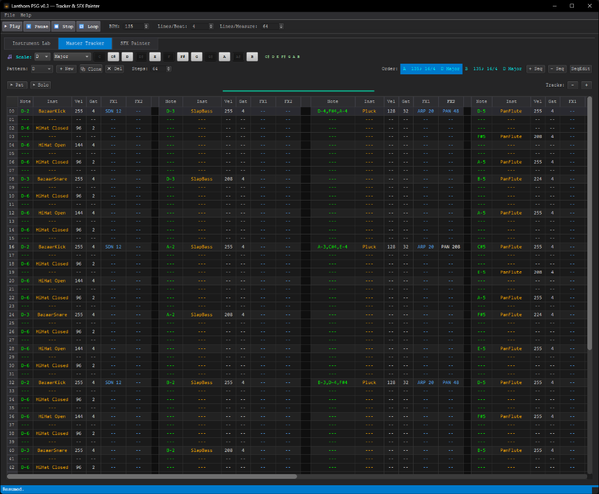
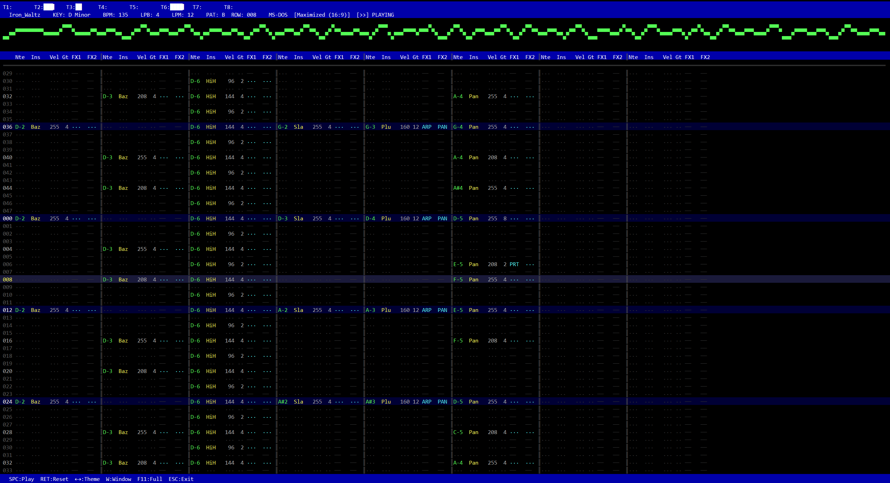
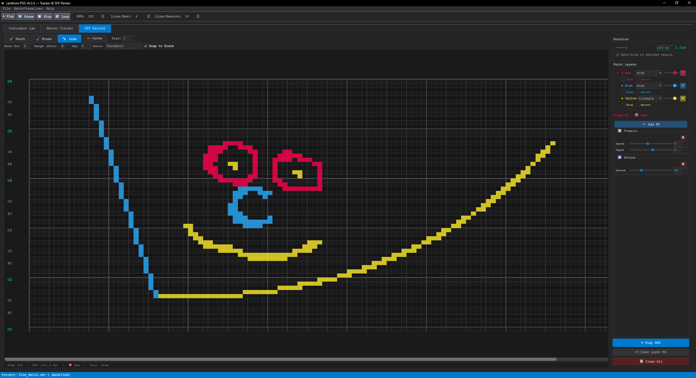
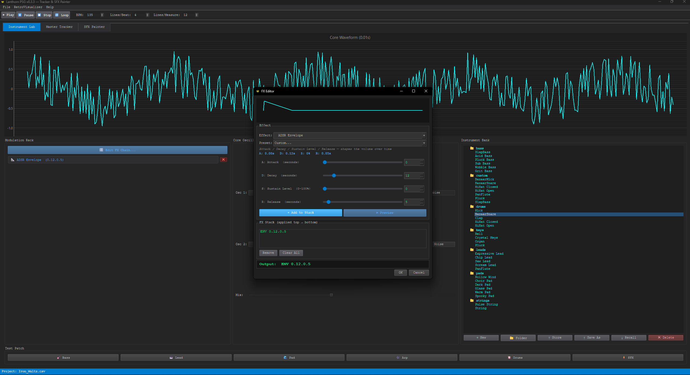
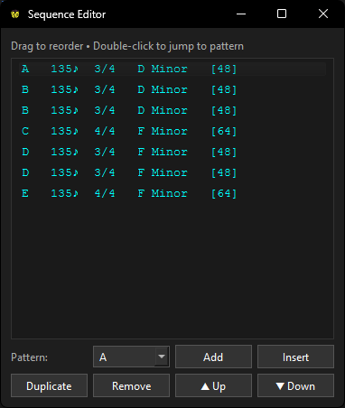
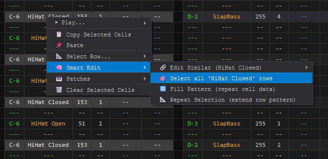

# 🕯️ Lanthorn PSG

**A chiptune-style tracker, SFX painter, and retro visualizer for composing game audio.**


Lanthorn PSG is a free, open-source desktop app for composing tracker-style chiptune music and painting retro sound effects. Design instruments from scratch with dual oscillators and a full FX chain, arrange patterns in a multi-track step sequencer, and export your creations as WAV, OGG, MP3, or even MP4 video.

---

## ✨ Features

| Feature | Description |
|---|---|
| **Master Tracker** | 8-track step sequencer with per-pattern BPM, key, mode, and time signatures |
| **Instrument Lab** | Dual oscillators, ADSR envelope, and modular FX chain (vibrato, echo, saturation, arpeggio, and more) |
| **SFX Painter** | Draw retro sound effects directly on a pitch/time grid with layered waveforms |
| **Retro Visualizer** | Fullscreen retro-style playback display with multiple themes and MP4 video export |
| **Sequence Editor** | Simple pattern ordering with BPM and key display |
| **Audio Export** | WAV (44.1kHz / 22kHz / 8kHz), OGG, and MP3 output via pydub |
| **Preset Library** | 50+ built-in instruments organised by category (leads, bass, pads, keys, drums, strings) |
| **Demo Projects** | Three complete songs included: *Bazaar*, *Lanthorn*, and *Iron Waltz* |

---

## 📸 Screenshots

### Master Tracker
Compose up to 8 tracks of chiptune music with per-pattern BPM, key, mode, and time signature support. Beat and measure grid highlighting lets you see the rhythmic structure at a glance.



### Retro Visualizer
A retro-style fullscreen playback view with oscilloscope, level meters, and multiple retro themes. Export your project as an MP4 video at 1080p.



### SFX Painter
Draw sound effects directly on a pitch/time canvas using paint, line, and curve tools across three waveform layers. Snap-to-scale keeps everything musical.



### Instrument Lab & FX Editor
Design instruments with dual oscillators, ADSR envelopes, and a modular FX rack. Over 50 built-in presets to get you started.



### Sequence Editor
Arrange patterns into a full song with easy reordering.



### Smart Edit & Context Menus
Speed up your workflow with intelligent right-click menus. Use **Smart Edit** to apply changes across all instances of an instrument, fill patterns, or repeat selections.



---

## 🚀 Getting Started

### Running from Source

**Requirements:** Python 3.12+

```bash
# Clone the repository
git clone https://github.com/Edwigeon/Lanthorn-PSG.git
cd Lanthorn-PSG

# Create a virtual environment named 'venv'
python3 -m venv venv

# Activate the virtual environment
# On macOS/Linux:
source venv/bin/activate
# On Windows (uncomment the line below and comment the one above):
# .\venv\Scripts\activate

# Upgrade pip and install dependencies inside the venv
pip install --upgrade pip
pip install -r requirements.txt

# Run the script
python main.py
```

> **Linux note:** you may need system audio libraries:
> ```bash
> sudo apt install libasound2-dev libportaudio2
> ```

---

## 🔨 Building a Standalone Executable

### Windows

```bat
build.bat
```

This will automatically:
1. Install all Python dependencies
2. Download a static **ffmpeg** build (for MP3 export)
3. Build a standalone executable via PyInstaller
4. Download **NSIS** (if needed) and create a Windows installer

Output: `LanthornPSG_Setup_0.3.3.exe`

### Linux

```bash
chmod +x build.sh
./build.sh
```

This will build a standalone binary, bundle all assets, and install a `.desktop` entry for your app launcher.

---

## 📁 Project Structure

```
lanthorn_psg/
├── main.py                   # Entry point
├── engine/                   # Audio synthesis & sequencer engine
│   ├── oscillator.py         #   Waveform generation (sine, square, tri, saw, noise)
│   ├── modifiers.py          #   FX processing (vibrato, echo, saturation, etc.)
│   ├── playback.py           #   Real-time audio sequencer
│   ├── theory.py             #   Music theory (scales, keys, intervals)
│   ├── preset_manager.py     #   Instrument preset I/O
│   └── csv_handler.py        #   Project file format
├── gui/                      # PyQt6 UI
│   ├── main_window.py        #   Application shell & menus
│   ├── tracker.py            #   Master Tracker (step sequencer)
│   ├── workbench.py          #   Instrument Lab (patch design)
│   ├── visualizer.py         #   SFX Painter (sound effect canvas)
│   ├── retro_visualizer.py   #   Retro Visualizer & MP4 export
│   ├── fx_ui_manager.py      #   FX Editor popup
│   ├── context_menu.py       #   Smart context menus
│   └── export_dialog.py      #   Audio export dialog
├── export/                   # Audio export
│   └── wave_baker.py         #   WAV / OGG / MP3 rendering
├── presets/                  # Built-in instrument library
├── build.bat                 # Windows build script
├── build.sh                  # Linux build script
├── lanthorn_psg.spec         # PyInstaller spec
├── lanthorn_installer.nsi    # NSIS Windows installer script
└── ENGINE_SPEC.md            # Full engine & FX command reference
```

See [`ENGINE_SPEC.md`](ENGINE_SPEC.md) for the complete reference.

---

## 📝 License

See [`LICENSE`](LICENSE) for details.
